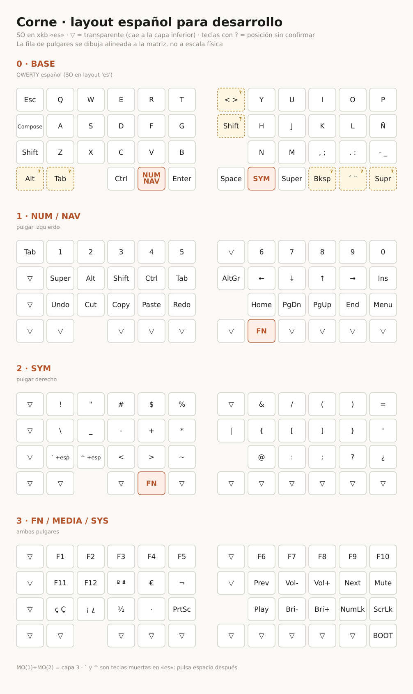

# Corne español para desarrollo

Layout de 46 teclas para un **Pilot W-CORNE** (Vial), pensado para escribir castellano y
programar con el sistema en **xkb `es`**.



## Cargarlo

1. Abre Vial con el teclado conectado.
2. *File → Load saved layout* → `corne_es_dev.vil`.
3. Los cambios se escriben en el teclado al instante; no hay que reflashear.

Si algo no te convence, edítalo en Vial, guarda el `.vil` y lo reintegramos a `spec.py`.

## Cómo funciona

El firmware manda **posiciones de un teclado US** y es el sistema quien las traduce con el
mapa `es`. Por eso aquí no existen "teclas de símbolo": todo son combinaciones
`LSFT(...)` y `RALT(...)` sobre teclas US. Cambiar el layout del sistema a otro que no sea
`es` rompería todos los símbolos.

Dos apoyos del mapa `es` que vertebran la capa SYM:

- `RALT(7/8/9/0)` = `{ [ ] }` — los cuatro corchetes en la fila numérica, índice→meñique.
- `RALT(4)` = `~` y **no es tecla muerta** en Linux. (`RALT(ñ)` sí lo es; no se usa.)

## Las capas

| Capa | Activación | Contenido |
|---|---|---|
| 0 · BASE | — | QWERTY, `Ñ`, `- _`, `, ;`, `. :`, `< >`, `´ ¨` |
| 1 · NUM/NAV | `MO(1)`, pulgar izquierdo | números, flechas en `HJKL`, `Home/PgDn/PgUp/End`, mods en la fila base, `Undo/Cut/Copy/Paste/Redo`, `AltGr` |
| 2 · SYM | `MO(2)`, pulgar derecho | todos los símbolos de programación |
| 3 · FN/MEDIA | ambos pulgares | F1–F12, multimedia, `º ª`, `€`, `¬`, `ç Ç`, `¡ ¿`, `½`, `·`, `« »` |

Las capas 4–7 se quedan transparentes, libres para lo que quieras.

### Castellano

`´` y `¨` están en la base, a la derecha del `Super` derecho: `´`+`a` → á, `¨`+`u` → ü.
`Ñ` está en su sitio de siempre. `ç Ç`, `¡ ¿`, `º ª`, `€` y `« »` viven en la capa 3.
Además, tu `Bloq. Mayús` es la tecla **Compose** del sistema (`compose:caps` en Hyprland),
así que se ha dejado intacta.

### Dos teclas muertas

En `es`, `` ` `` y `^` son teclas muertas: hay que **pulsar espacio detrás** para que salga
el carácter. Están en la capa SYM etiquetadas `` ` +esp`` y `^ +esp`. Se puede resolver con
una macro de dos pulsaciones; queda para la siguiente iteración.

## El repositorio

```
spec.py              # LAS CAPAS. Fuente de verdad de todo lo demás
build_vil.py         # spec.py + baseline → corne_es_dev.vil
render_diagram.py    # spec.py → docs/corne-es-layout.svg
baseline/            # el .vil original, intacto
corne_es_dev.vil     # el fichero que se carga en Vial
PLAN.md              # el porqué de cada decisión, con la tabla xkb es verificada
```

Para cambiar algo: se edita `spec.py` y se ejecuta

```bash
python3 build_vil.py && python3 render_diagram.py
```

`build_vil.py` no reconstruye el `.vil`: carga el original, sustituye **solo** `layout` y
vuelca. Comprueba con asserts que el volcado sin cambios reproduce el original byte a byte,
que `uid`, combos, tap-dances y ajustes no se tocan y que ninguna tecla cae en una posición
inexistente de la matriz.

## Pendiente para la v2

- Macro para `` ` `` y `^` (backtick de una sola pulsación).
- Combos (Vial tiene 32 libres): por ejemplo `J`+`K` → Esc.
- Home-row mods, si compensa el reentreno.
- Confirmar con el *Matrix tester* de Vial las 7 posiciones que se dedujeron sin ver el
  teclado: la columna interior derecha y las esquinas de la fila inferior.
